# Machine Team: Master Orchestrator

多 Agent 协作编排系统 — 基于 Claude Code 的角色分离、信息隔离、流程刚性架构。

## 核心理念

> 不是先画完流程图再往里面填角色，而是先深度设计每个角色，再从角色之间的自然张力中发现流程的缺失，反过来优化流程。

- **角色分离** — 20 个子 Agent，各司其职，互不越界
- **信息隔离** — 双审计师无法看到彼此的原始报告，防止串通
- **流程刚性** — 每个组有严格的 SOP，不可跳步（除非总指挥授权）
- **信号驱动** — 任务完成后自动检测跨组信号，触发后续流程
- **文件契约** — 产出物是角色间的显性契约，有明确的命名、存储和生命周期规范

---

## 架构总览

```
总指挥 (Commander)
    ↓ 提交任务
总调度层 (Master Orchestrator) — CLAUDE.md
    ↓ 路由 + 分发
6 个组编排器 (Group Orchestrators) — groups/*.md
    ↓ 按 SOP 召唤
20 个子 Agent — .claude/agents/*.md
    ↓ 产出物落盘
会话数据 — sessions/{session-id}/
知识沉淀 — knowledge/
```

<a href="diagrams/总调度版本完整流程图.svg">
  
</a>

> 点击图片可查看原图

---

## 项目结构

```
总调度版本/
├── CLAUDE.md                          ← 总调度层主控（自动加载）
├── .claude/agents/                    ← 20 个子 Agent 定义
│   ├── defect-programmer-standard.md
│   ├── defect-programmer-fast.md
│   ├── defect-auditor-a.md
│   ├── defect-auditor-b.md
│   ├── defect-qa-validator.md
│   ├── feature-pm.md
│   ├── feature-architect.md
│   ├── feature-engineer.md
│   ├── feature-qa.md
│   ├── feature-technical-writer.md
│   ├── debt-auditor.md
│   ├── debt-refactor-engineer.md
│   ├── debt-regression-qa.md
│   ├── research-engineer.md
│   ├── research-tech-evaluator.md
│   ├── risk-security-auditor.md
│   ├── risk-hardening-engineer.md
│   ├── risk-qa.md
│   ├── knowledge-manager.md
│   └── knowledge-training-designer.md
├── groups/                            ← 6 个组的内部 SOP
│   ├── defect-fix.md
│   ├── feature-dev.md
│   ├── debt-cleanup.md
│   ├── research.md
│   ├── risk-mitigation.md
│   └── knowledge-mgmt.md
├── sessions/                          ← 会话数据（运行时生成）
│   └── {session-id}/                  ← 单次会话
│       ├── session-log.md             ← 总调度会话日志
│       └── TASK-{seq}/                ← 按任务序号分区
│           ├── brief.md              ← 任务简报（总指挥原始指令）
│           ├── work/                 ← 工作底稿（组内流转）
│           └── summary.md            ← 任务最终摘要
├── knowledge/                         ← 知识库（长期资产）
│   ├── entries/                       ← 知识条目 KE-{YYYY-MM-DD}-{seq}.md
│   └── paths/                         ← 学习路径 LP-{topic}.md
├── docs/
│   ├── 方法论.txt                     ← 角色设计方法论
│   ├── 总调度版本 - 配置文件总览.txt
│   └── Agent产出物文件管理规范.md      ← 文件命名、存储、落盘、生命周期规范
└── diagrams/
    └── 总调度版本完整流程图.mermaid
```

---

## 6 个组与触发规则

| 组 ID | 组名称 | Agent 数 | 触发关键词 | 核心价值 |
|--------|--------|----------|-----------|---------|
| DEFECT | 缺陷修复组 | 5 | Bug, 缺陷, 报错, 异常, 崩溃, 回归 | 双盲审计 + QA 否决，修复不引入新问题 |
| FEATURE | 功能开发组 | 5 | 新功能, 需求, 功能开发, 用户故事 | PM→架构→工程→QA 全链路，每个环节可打回上游 |
| DEBT | 技术债务清理组 | 3 | 重构, 技术债, 代码质量, 清理, 债务 | 行为不变红线约束下的定向清理 |
| RESEARCH | 技术调研与原型验证组 | 2 | 调研, 技术选型, 可行性, 原型, 对比, 评估 | 时间盒约束 + 独立方法论审计，三态结论 |
| RISK | 风险缓解与安全加固组 | 3 | 安全, CVE, 漏洞, 加固, 审计, 渗透 | 安全审计→加固→三重验证（回归+性能+攻击模拟） |
| KNOWLEDGE | 知识管理与培训组 | 2 | (不可用户触发 — 仅事件驱动) | 从任务产出提取经验，设计学习路径 |

---

## 20 个 Agent 清单

### 缺陷修复组 (DEFECT) — 5 人

| Agent | 角色 | 核心职责 |
|-------|------|---------|
| `defect-programmer-standard` | 程序员（标准） | 根因分析、修复方案（带意图标签）、执行修改、测试草案 |
| `defect-programmer-fast` | 程序员（紧急） | 快速止血、紧急修复、临时方案 |
| `defect-auditor-a` | 安全审计 | 安全漏洞、边界条件、危险假设审查 |
| `defect-auditor-b` | 架构审计 | 性能影响、架构合理性、技术债务审查 |
| `defect-qa-validator` | QA 验证 | 测试执行、回归排查、补充观察、质量否决 |

### 功能开发组 (FEATURE) — 5 人

| Agent | 角色 | 核心职责 |
|-------|------|---------|
| `feature-pm` | 产品经理 | 需求定义、验收条件、优先级排序、最终验收否决 |
| `feature-architect` | 架构师 | 技术方案设计、架构约束、方案否决、债务记录 |
| `feature-engineer` | 工程师 | 需求理解、代码实现、自测报告、文档变更标注 |
| `feature-qa` | QA | 验收条件前置审查、测试设计与执行、质量否决 |
| `feature-technical-writer` | 技术作家 | 文档撰写更新、API 模糊性打回 |

### 技术债务清理组 (DEBT) — 3 人

| Agent | 角色 | 核心职责 |
|-------|------|---------|
| `debt-auditor` | 债务审计师 | 债务识别与定义、清理方案设计、不可变行为红线 |
| `debt-refactor-engineer` | 重构工程师 | 方案可行性评估、代码重构执行、风险暂停声明 |
| `debt-regression-qa` | 回归 QA | 行为不变验证、债务清除验证、否决交付 |

### 技术调研组 (RESEARCH) — 2 人

| Agent | 角色 | 核心职责 |
|-------|------|---------|
| `research-engineer` | 调研工程师 | 实验设计、原型搭建、数据收集、初步结论 |
| `research-tech-evaluator` | 技术评估师 | 实验方法审核、最终建议（三态）、风险量化、替代方案 |

### 风险缓解组 (RISK) — 3 人

| Agent | 角色 | 核心职责 |
|-------|------|---------|
| `risk-security-auditor` | 安全审计师 | 风险识别与分级、加固方向制定、优先级排序 |
| `risk-hardening-engineer` | 加固工程师 | 方案可行性评估、加固执行、临时缓解措施 |
| `risk-qa` | 风险验证 QA | 三重验证（功能回归 / 性能基线 / 攻击模拟） |

### 知识管理组 (KNOWLEDGE) — 2 人

| Agent | 角色 | 核心职责 |
|-------|------|---------|
| `knowledge-manager` | 知识管理员 | 从任务产出中提取知识、时效标注、来源引用 |
| `knowledge-training-designer` | 培训设计师 | 可教学性评估、学习路径设计、技能缺口诊断 |

---

## 各组工作流程

### 缺陷修复组 (DEFECT) — 标准通道 8 步 + 紧急通道 3 步

```
标准通道：
Step 1: 召唤 programmer-standard → 根因分析 + 修复方案 + 测试草案
Step 2: 并行召唤 auditor-a + auditor-b（信息隔离，互不可见）
Step 3: 主控信号过滤 → 去重、识别冲突、标记越界
Step 4: 去身份化交叉质询 → 匿名化分歧点，强制独立判断
Step 5: 形成最终审计报告 → 共识项 + 未解决分歧项
Step 6: 重新召唤 programmer → 逐条回应 + 独立技术判断
Step 7: 召唤 qa-validator → 三态结论
Step 8: QA 后分流 → PASS关闭 / FAIL回Step6 / OBSERVATIONS评估

紧急通道：programmer-fast → auditor-a（仅安全）→ qa-validator
```

### 功能开发组 (FEATURE) — 10 步

```
Step 0: 判断是否启用 Technical Writer
Step 1: PM → 用户故事 + 验收标准 + 非目标
Step 2: Architect → 技术方案 + 架构约束 + 债务评估
Step 3: Engineer → 需求澄清（模糊打回 PM）+ 可挑战架构约束
Step 4: Engineer 实现 → 代码 + 自测报告 + 文档变更标记
Step 5-7: QA → 前置审查验收条件 → 执行测试 → 三态结论
Step 8: PM 最终验收 → 对照原始标准，不接受新增
Step 9: Technical Writer（如启用）→ API 模糊打回权
Step 10: 关闭
```

### 技术债务清理组 (DEBT) — 6 步

```
Step 1: debt-auditor → 债务项 + 清理计划 + 不可变行为红线
Step 2: refactor-engineer 评估可行性 → 不可行则讨论
Step 3: Engineer 执行 → 变更摘要 + 行为保持声明
Step 4: regression-qa → PASS / FAIL(VETO) / PASS with Reservations
Step 5: 评估保留意见 → 未真正清除则回到 Step 1
Step 6: 关闭
```

### 技术调研组 (RESEARCH) — 5 步

```
入口：由其他组提交调研请求（非用户直接触发）

Step 1: 召唤 research-engineer（带时间盒约束）
Step 2: 时间盒监控 — 80% 警告，到期强制提交
Step 3: tech-evaluator 独立审计 → REJECT 则重新调研
Step 4: 交付结论 → 可行/不可行/有条件可行
Step 5: 关闭
```

### 风险缓解组 (RISK) — 7 步

```
Step 1: security-auditor → 风险列表 + 严重性 + 加固方向
Step 2: hardening-engineer 评估可行性 → 不可行则讨论
Step 3: Engineer 执行加固
Step 4: risk-qa 三重验证 → 功能回归 + 性能基线 + 攻击模拟
Step 5: 残余风险评估 → 可接受则设定审查日期
Step 6: 关闭
```

### 知识管理组 (KNOWLEDGE) — 事件驱动

```
触发条件（满足任一）：
  - 新颖根因或 Bug 模式
  - 新架构决策或设计模式
  - 解决了先前未知的技术约束
  - 安全发现值得泛化
  - 首次集成外部系统
  - 可复用的解决方案

流程：knowledge-manager 提取 → 合规检查 → training-designer 评估 → 学习路径 → 效果追踪
```

---

## 文件管理

> 完整规范见 [docs/Agent产出物文件管理规范.md](docs/Agent产出物文件管理规范.md)

### 核心原则

文件是角色间的**显性契约**，不仅仅是信息容器。

### 目录结构

| 目录 | 用途 | 生命周期 |
|------|------|---------|
| `sessions/{session-id}/` | 单次会话的所有数据 | 会话期间，结束后归档 |
| `sessions/{id}/TASK-{seq}/brief.md` | 任务简报（总指挥原始指令） | 永久 |
| `sessions/{id}/TASK-{seq}/work/` | 工作底稿（组内流转） | 任务期间 |
| `sessions/{id}/TASK-{seq}/summary.md` | 任务最终摘要 | 永久 |
| `sessions/{id}/session-log.md` | 会话日志 | 永久 |
| `knowledge/entries/` | 知识条目 | 长期，定期复核 |
| `knowledge/paths/` | 学习路径 | 长期，引用条目过期时更新 |

### 落盘策略

```
必须落盘：                          不落盘（内存传递）：
├── 多角色并行读取                   ├── 串行单次传递
├── 跨组交接                         ├── 被打回重做的草稿
├── 给总指挥的最终结论               └── 主控脱敏中转内容
└── 跨任务复用的长期资产
```

### 命名规范

| 文件类型 | 命名格式 | 示例 |
|---------|---------|------|
| 工作底稿 | `{产出类型}.md` | `root-cause.md`, `audit-security.md` |
| 最终摘要 | `summary.md` | — |
| 知识条目 | `KE-{YYYY-MM-DD}-{seq}.md` | `KE-2026-05-11-001.md` |
| 学习路径 | `LP-{主题名}.md` | `LP-security-audit.md` |

### YAML 元数据

所有落盘文件头部统一包含：

```yaml
---
created: 2026-05-11T14:30:00+08:00
author: defect-programmer-standard
task_id: TASK-001
session_id: S-20260511-01
type: work
---
```

知识条目额外包含 `last_verified`、`next_review`、`status`、`source_task` 字段。

### 各组落盘清单

| 组 | 必须落盘 | 不落盘 |
|----|---------|--------|
| DEFECT | root-cause, audit-security, audit-architecture, final-audit, qa-validation | fix-report |
| FEATURE | prd, architecture, test-result, acceptance, docs-update | self-test |
| DEBT | cleanup-plan, redlines, regression-result | change-summary |
| RESEARCH | experiment-report, evaluation | — |
| RISK | risk-list, triple-verify, residual-risk | hardening-report |
| KNOWLEDGE | knowledge-entry, learning-path, knowledge-health | — |

---

## 跨组信号协议

| 信号 | 产生方 | 消费方 | 需总指挥确认? |
|------|--------|--------|--------------|
| `TECH_DEBT_FOUND` | 任意组 | 技术债务清理组 | 是 |
| `SECURITY_RISK_FOUND` | 任意组 | 风险缓解组 | 是 |
| `POST_AUDIT_REQUIRED` | 缺陷修复组(紧急通道) | 风险缓解组 / 债务清理组 | 是 |
| `KNOWLEDGE_WORTHY` | 任意组 | 知识管理组 | **否（自动触发）** |
| `RESEARCH_NEEDED` | 任意组 | 技术调研组 | 是 |

跨组交接时，新任务的 `brief.md` 必须记录 `parent_task` 和 `handoff_signal`，形成追溯链。

---

## 核心设计机制

### 信息隔离与防串通

- Auditor-A 与 Auditor-B **永远看不到对方的原始报告**
- 去身份化交叉质询：分歧点以匿名方式发给对方评估
- 问题白名单 / 黑名单：只允许特定格式的问题
- 反摸鱼条款：接受对方观点时必须补充未覆盖的风险点
- 程序员独立判断：收到审计报告后必须做出独立技术判断，禁止盲目折中

### 五类制衡模式

| 制衡模式 | 描述 | 典型案例 |
|----------|------|---------|
| 质疑-回应 | A 提出判断，B 可以质疑，A 必须回应 | 重构工程师挑战债务审计师的清理方案 |
| 独立审核 | B 独立审查 A 的产出，有权打回 | 技术评估师审核调研工程师的实验方法 |
| 双线并行 | 同一输入给两个角色，从不同视角产出 | 审计A（安全）+ 审计B（性能）审查同一份修复方案 |
| 最终验收 | 裁决权交给独立于执行链的角色 | PM 在 QA 全部通过后仍有验收否决权 |
| 实证推翻 | B 用实际测试结果推翻 A 的理论判断 | 风险验证 QA 的攻击模拟推翻安全审计师的加固方向 |

### 优先级仲裁

```
1. 紧急通道任务（P0 安全漏洞、服务中断）
2. POST_AUDIT_REQUIRED 跟进
3. 活跃组转交（等待分发的跨组信号）
4. 标准任务
5. 知识管理（始终异步，永不紧急）
```

### 腐化模式预判

每个角色在设计阶段就预判了最可能的腐化模式并内置预防机制。六组共预判了 30+ 种腐化模式：

| 腐化类型 | 典型表现 | 预防原则 |
|----------|---------|---------|
| 权限膨胀 | 角色逐渐侵入其他领域 | 明确领域边界 + 主 Agent 越界过滤 |
| 偷懒趋同 | 双审计互相附和 | 信息隔离 + 强制产出差异 + 禁止赞同措辞 |
| 过度敏感 | 把一切视为高风险 | 量化分级标准 + 具体判例 |
| 确认偏误 | 只找支持自己预判的证据 | 独立审核角色天然携带怀疑眼光 |
| 范围蔓延 | 超出授权范围做事 | 主 Agent 检查输出与授权范围一致性 |
| 模糊化逃避 | 用模糊结论规避责任 | 强制输出格式（三态/量化） |

---

## 为什么改代码比从零开发更适合

这套系统最强的地方是**对比和验证**。改代码时，旧代码同时扮演三个角色：

1. **旧代码就是约束** — AI 不需要重新做决策，决策空间被压缩到只有"怎么改"
2. **代码本身就是文档** — AI 读代码就能感知项目约定，不需要依赖可能过时的文档
3. **有旧代码可以 diff** — 改完之后能对比验证，知道改对了还是改坏了

从零开发时这三者都不存在，审计、回归、行为红线等机制都会空转。**先有旧代码，系统才有用武之地。**

---

## 使用方式

### 部署

1. 将整个项目文件夹复制到目标项目根目录
2. 确保 `.claude/agents/` 目录结构不变
3. 在 Claude Code 中打开项目，`CLAUDE.md` 会自动加载

### 提交任务

在 Claude Code 对话框中直接输入任务描述，例如：

```
我的登录页面有 bug，用户输入正确密码也提示"密码错误"
```

Claude 会自动：
1. 分类任务 → 匹配到缺陷修复组
2. 输出 `TASK_ROUTE` → 等你确认
3. 创建 `sessions/{id}/TASK-{seq}/brief.md` → 写入任务简报
4. 分发到对应组 → 按 SOP 执行，产出物落盘到 `work/` 目录
5. 完成后汇报 → 生成 `summary.md` → 检查跨组信号
6. 触发知识管理（如满足条件）→ 提取知识条目到 `knowledge/entries/`

### 会话生命周期

```
会话开始 → 创建 sessions/{id}/
  → 任务路由 → 创建 TASK-{seq}/brief.md
    → 组内执行 → 产出物落盘到 work/
    → 任务关闭 → 生成 summary.md
  → 跨组信号检测 → 可能创建新 TASK
  → 知识触发 → 可能生成 KE-*.md
会话结束 → 完成 session-log.md
```

---

## 方法论：Agent 设计经验总结

### 核心发现：把 Agent 当人设计，而不是当螺丝钉

传统思路是先画流程图，再往里面填角色。但实践中发现这是一条死路——流程图永远赶不上角色之间的真实互动。真正的驱动力来自角色本身的视角、权利和制衡。核心方法论由此反转：**先深度设计每个角色，再从角色之间的自然张力中发现流程的缺失，反过来优化流程。**

这个反转来自三个关键时刻：

1. **设计程序员时**，发现他应该有"拒绝权"和"独立技术判断权"，于是流程从单向指令链变成了有张力的讨论三角。
2. **设计 QA 时**，发现他应该有"补充观察发言权"，于是流程从通过/失败二元判断变成了三元输出，并增加了补充交叉讨论的二次闭环。
3. **设计审计 A/B 时**，发现他们必须信息隔离，主 Agent 必须是唯一通信总线，所有跨审计信息必须脱敏中继，强制质疑且禁止赞同，否则偷懒附和会让交叉讨论彻底失效。

> 根本洞察：给 Agent 一个"会腐烂的人设"，然后提前预防它的腐烂，比给它一个完美的角色说明书更可靠。

### 角色设计四步法

每个角色都经过四步深度推敲，确保它在团队中是不可替代的、有权利的、受监督的、有边界的。

| 步骤 | 核心问题 | 设计要点 |
|------|---------|---------|
| 1. 定位 | 这个角色提供了什么别人看不到的独特视角？ | 视角必须不可替代，与其他角色不重叠 |
| 2. 权利 | 他需要哪些决策权才能完成使命？ | 否决权、判断权、建议权三级划分 |
| 3. 制衡 | 谁可以挑战他？他需要向谁解释？ | 五种制衡模式，每个判断权对应独立制衡方 |
| 4. 边界 | 他绝对不允许做什么？最可能的腐化模式是什么？ | 四类边界 + 内置腐化预防机制 |

### 流程图方法论：角色权利的视觉化

> 核心命题：流程图是角色权利的投影，不是流程的预设。

每一个分支、每一个打回、每一个闭环，都来自某个角色的权利声明：

- **需求推动**：先有角色权利的冲突和争议，才产生流程分支
- **打回推动**：工程师向 PM 打回、QA 向 PM 打回——向上游的反馈改造了线性流程
- **三元推动**：QA 输出从二元到三元，创造了二次讨论闭环
- **双重闭环推动**：PM 最终验收否决权，确保"功能正确"不等于"用户价值正确"

### 工程落地：从角色设计到可部署配置

1. **独立组封装**：每个组可独立运行
2. **总调度层集成**：加路由器 + 拍平 Agent 文件 + 组 SOP 降级为参考文档
3. **配置文件**：YAML 前置元数据 + Markdown 正文（思维链、输出模板、防腐规则）
4. **文件管理**：会话隔离 + 任务分区 + 知识沉淀 + 落盘策略 + 元数据规范

详细方法论见 [docs/方法论.txt](docs/方法论.txt)。

---

## License

MIT
